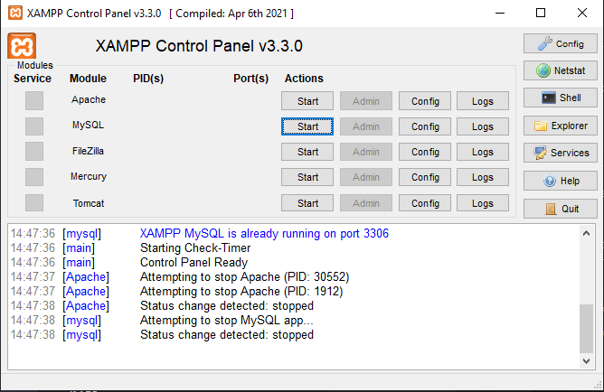
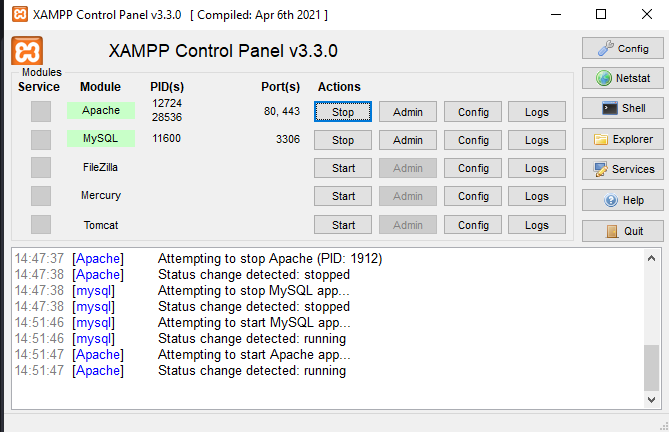
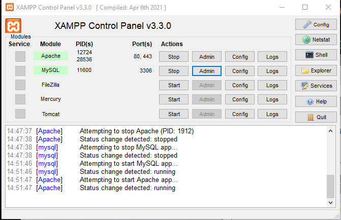

PCMaker

Esse é um sistema web desenvolvido como Trabalho de Conclusão de Curso (TCC) para a formação em Técnico em Informática (2025). O PCMaker permite que o usuário verifique a compatibilidade entre diferentes peças de computador, analise suas informações técnicas e estime o gasto energético da configuração escolhida — tudo antes de realizar a compra.

Funcionalidades

    Usuário comum
        Consultar peças cadastradas no sistema
        Verificar compatibilidade entre diferentes componentes (processador, placa mãe, RAM, GPU, coolers, entre outros)
        Analisar informações técnicas de cada peça
        Estimar o consumo energético da configuração montada

    Administrador
        Adicionar novas peças ao catálogo
        Editar ou excluir peças já cadastradas
        Cadastrar novos usuários
        Visualizar todas as peças registradas no sistema
        Login com controle de sessão e permissões restritas à área administrativa
Tech Stack
    Front-end: HTML, CSS, JavaScript
    Back-end: PHP
    Banco de dados: SQL (MySQL)

Pré-requisitos para o funcionamento do sistema:
    XAMPP instalado (inclui Apache, MySQL e PHP)
    Navegador web atualizado

Importante: não abra os arquivos .php diretamente pelo VS Code (F5) ou por duplo clique. 
O PHP só é interpretado quando o arquivo passa por um servidor como o Apache. 
Sempre acesse o projeto pelo navegador, através do endereço localhost.

-> Para você conseguir fazer o programa funcionar, é necessário estar com o XAMPP rodando. 

-> Você precisará colocar a pasta do projeto dentro do htdocs na pasta xampp. Geralmente basta você acessar o seu disco C (ou onde o XAMPP estiver instalado).

-> Ao executar o XAMPP, inicie o APACHE e o MySQL. 

-> Para acessar o banco de dados local, clique no botão Admin, ao lado do Mysql. 

-> É necessário a importação do arquivo "pcmaker.sql" presente no projeto.

-> Após a importação do database, o sistema deve estar funcionando perfeitamente.

-> Acesse o site digitando "http://localhost/tcc/index.html" (isso considerando que você colocou a pasta do projeto em htdocs, na pasta do xampp)

Como usar o sistema: 
    Usuário comum:
        O usuário comum possui acesso as páginas comuns do site:
            Monte seu PC
            Calculadora de gasto energético
            Inicio do site
            Tutoriais

    Administrador:
        Os administradores possuem acesso a funções restritas, podendo realizar alterações no banco de dados do sistema:
            Dashboard que leva para as outras páginas 
            Adicionar produtos
            Editar produtos
            Visualizar Produtos
            Excluir produtos
            Adicionar administradores

        O login para administrador padrão é o seguinte:
            Email: admin@email.com
            Senha: admin123

Projeto desenvolvido como Trabalho de Conclusão de Curso — Técnico em Informática, ETEC de Iguape, 2025.

Acesse meu perfil no GitHub!
    https://github.com/rhyan201